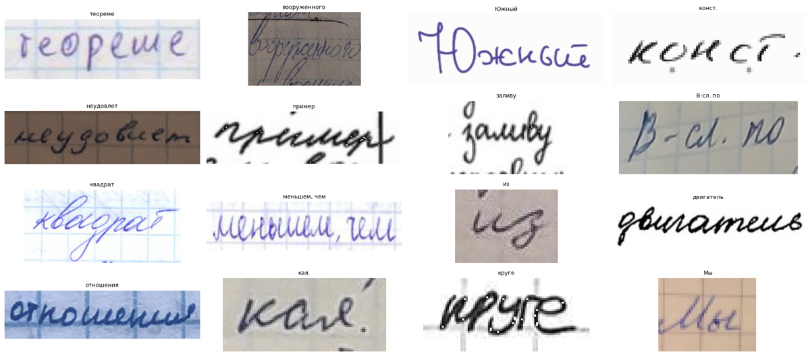

# Cyrillic Handwritten Text Recognition

Python package and pipeline for handwritten Cyrillic text recognition.

The project solves a handwritten text recognition task: given an image of a handwritten Cyrillic text line or a short cropped fragment, the model returns a Unicode text  transcription.

The repository contains:

- data download and preprocessing scripts;
    
- reproducible Hydra configuration;
    
- DVC-based data and model artifact management with Google Drive;
    
- PyTorch Lightning training code;
    
- MLflow experiment logging;
    
- CRNN-CTC baseline model;
    
- Transformer HTR model;
    
- evaluation and prediction scripts;
    
- ONNX export for the Transformer model;
    
- MLflow Serving wrapper for production-style inference;
    
- CRNN-CTC Colab notebook with baseline experiments;
    
- Transformer HTR Colab notebook with two-stage training experiments.
    

## Problem statement

The goal of the project is to build a model for recognizing handwritten Cyrillic text.

Such a system can be used for digitizing handwritten notes, historical documents, forms,  
archive materials and other sources where OCR for printed text is not enough.

The task is formulated as sequence recognition:

- input: image of a handwritten text line or short cropped text fragment;
    
- output: sequence of recognized Cyrillic characters.
    

During training, one sample consists of:

- `image`: PNG/JPEG image of a handwritten text fragment;
    
- `target_text`: Unicode string with the ground-truth transcription.
    

At inference time, the model returns a predicted Unicode text string.

## Dataset

The main real dataset is the Cyrillic Handwriting Dataset from Kaggle:

```text
 https://www.kaggle.com/datasets/constantinwerner/cyrillic-handwriting-dataset
```



The configured project paths are:

```text
data/raw/cyrillic-handwriting-dataset/train.tsv
data/raw/cyrillic-handwriting-dataset/test.tsv
data/processed/train_split.tsv
data/processed/val_split.tsv
data/processed/test_split.tsv
data/processed/vocab.json
```

Data is managed with DVC. Raw and processed data files are not stored directly in git.

The final Transformer HTR training pipeline also uses synthetic Cyrillic line images for pretraining. Synthetic data is used only as an auxiliary training source. Final evaluation is performed on the real held-out test split.

## Metrics

The main metric is Character Error Rate, or CER.

CER is the primary metric because handwritten text recognition is sensitive to  
character-level substitutions, deletions and insertions.

The secondary metric is Word Error Rate, or WER. It is useful for estimating how readable  
the final text is at word level, but it can be too coarse for short text lines.

The evaluation code also reports additional metrics:

- line accuracy;
    
- edit similarity;
    
- valid character rate;
    
- normalized CER;
    
- normalized WER.
    

## Models

### CRNN-CTC baseline

The baseline model is CRNN with CTC loss.

The CNN part extracts visual features from the image. The recurrent part models the sequence along the image width. CTC allows training without explicit alignment between input image positions and output characters.

Config:

```text
configs/model/crnn_ctc.yaml
```

The CRNN-CTC baseline is used as a reference model for training and evaluation.

### Transformer HTR

The main model is a Transformer-based handwritten text recognition model.

It consists of:

- lightweight convolutional visual feature extractor;
    
- Transformer encoder;
    
- Transformer decoder;
    
- autoregressive decoding into text tokens.
    

Config:

```text
configs/model/transformer_htr.yaml
```

The final Transformer HTR checkpoint is produced by synthetic pretraining followed by  
fine-tuning on real data with train-time augmentations. The Transformer model is used for  
final evaluation, ONNX export and MLflow Serving.

## Model-specific preprocessing

The final checkpoints should be evaluated and served with the same preprocessing setup  
that was used for their corresponding training/evaluation runs.

The CRNN-CTC baseline uses its Colab training configuration:

```bash
model=crnn_ctc
train=colab
infer.vocab_path=data/processed/vocab.json
```

The final Transformer HTR checkpoint uses explicit preprocessing overrides:

```bash
model=transformer_htr
train=colab_transformer
data.max_width=256
data.image_mean=0.0
data.image_std=1.0
model.max_decoding_length=60
infer.vocab_path=data/processed/vocab.json
```

Use these Transformer overrides for evaluation, single-image prediction, ONNX export and  
MLflow Serving package creation.

## Final evaluation results

Final test-set evaluation was performed on 1544 real test samples.

|Model|CER|WER|Line accuracy|Edit similarity|Valid character rate|Normalized CER|Normalized WER|
|---|--:|--:|--:|--:|--:|--:|--:|
|CRNN-CTC baseline|0.1580|0.5977|0.3420|0.8427|1.0000|0.1429|0.5563|
|Transformer HTR|0.1451|0.5043|0.4430|0.8642|1.0000|0.1280|0.4635|

The Transformer HTR model improves over the CRNN-CTC baseline on CER, WER, line  
accuracy and edit similarity.

## Project structure

```text
.
├── .dvc/                         # DVC configuration and remotes
├── configs/                      # Hydra configuration
│   ├── config.yaml               # main Hydra entrypoint
│   ├── data/                     # data configuration
│   ├── dvc/                      # DVC pull configuration
│   ├── export/                   # ONNX export configuration
│   ├── infer/                    # inference/evaluation paths
│   ├── logger/                   # MLflow logger configuration
│   ├── model/                    # model-specific configs
│   ├── serving/                  # MLflow Serving config
│   └── train/                    # local and Colab training configs
├── data/                         # DVC-managed data artifacts
├── notebooks/
│   └── colab/
│       ├── train_colab.ipynb                 # CRNN-CTC baseline experiments
│       └── transformer_htr_training.ipynb    # Transformer HTR experiments
├── reports/                      # metrics, plots and predictions
├── scripts/                      # command-line entrypoints
│   ├── build_mlflow_model.py
│   ├── download_data.py
│   ├── evaluate.py
│   ├── export_onnx.py
│   ├── plot_metrics.py
│   ├── predict.py
│   ├── prepare_splits.py
│   ├── preprocess_data.py
│   ├── request_mlflow_server.py
│   └── train.py
├── src/
│   └── cyrillic_htr/             # Python package
│       ├── data/
│       ├── inference/
│       ├── metrics/
│       ├── models/
│       ├── serving/
│       └── training/
├── tests/                        # tests
├── models.dvc                    # DVC pointer for model artifacts
├── pyproject.toml                # package metadata and dependencies
├── uv.lock                       # uv lock file
└── README.md
```

## Setup

### 1. Clone repository

```bash
git clone https://github.com/elizaveta112/cyrillic-htr.git
cd cyrillic-htr
```

### 2. Install uv

If `uv` is not installed:

```bash
curl -LsSf https://astral.sh/uv/install.sh | sh
```

Restart the terminal if needed.

### 3. Install dependencies

```bash
uv sync --all-groups
```

The project uses Python `>=3.11,<3.13`.

### 4. Install pre-commit hooks

```bash
uv run pre-commit install
```

Run all checks:

```bash
uv run pre-commit run -a
```

Expected result: all hooks pass successfully.

## Dependency management

Dependencies are managed with `uv`.

Important dependency files:

```text
pyproject.toml
uv.lock
```

The project uses:

- PyTorch and PyTorch Lightning for training;
    
- Hydra for configuration;
    
- DVC and DVC Google Drive remote for data/model artifact management;
    
- MLflow for experiment tracking and serving;
    
- ONNX for model export;
    
- FastAPI/Uvicorn as serving dependencies;
    
- Ruff and pre-commit for code quality checks.
    

The notebooks in `notebooks/colab/` are kept as experiment reports. Production training,  
evaluation, inference and serving entrypoints are implemented in the Python package and  
`scripts/`.

## DVC data and model artifacts

The project uses DVC for data and trained model artifacts.

There are two DVC remotes:

- `data_remote` for datasets;
    
- `models_remote` for trained models and exported model artifacts.
    

The repository stores DVC pointer files in git. Large files are stored in Google Drive and  
are pulled with DVC.

### Google Drive service account access

The DVC remotes are stored in Google Drive and are accessed through a service account.

The repository stores only non-secret DVC remote configuration in git:

```text
.dvc/config
```

The service account JSON key is not committed to the repository. It must be provided  
separately and stored outside the repository.

Expected key filename:

```text
cyrillic-htr-dvc-b4c2a1a746da.json
```

Example location on the local machine:

```bash
mkdir -p ~/keys
cp /path/to/cyrillic-htr-dvc-b4c2a1a746da.json \
  ~/keys/cyrillic-htr-dvc-b4c2a1a746da.json
chmod 600 ~/keys/cyrillic-htr-dvc-b4c2a1a746da.json
```

After cloning the repository, configure the local path to the service account key:

```bash
uv run dvc remote modify --local data_remote \
  gdrive_service_account_json_file_path ~/keys/cyrillic-htr-dvc-b4c2a1a746da.json

uv run dvc remote modify --local models_remote \
  gdrive_service_account_json_file_path ~/keys/cyrillic-htr-dvc-b4c2a1a746da.json
```

These commands create or update:

```text
.dvc/config.local
```

This file is local-only and must not be committed to git.

The repository `.dvc/config` should contain only safe non-secret settings such as remote  
URLs and `gdrive_use_service_account = true`. The path to the JSON key must be stored only  
in `.dvc/config.local`.

### Pull DVC artifacts

Pull raw and processed data artifacts:

```bash
uv run dvc pull data/raw/cyrillic-handwriting-dataset.dvc -r data_remote
uv run dvc pull data/processed.dvc -r data_remote
```

Pull model artifacts:

```bash
uv run dvc pull models.dvc -r models_remote
```

After pulling model artifacts, the expected files are:

```text
models/crnn_ctc/crnn_baseline_best.ckpt
models/transformer_htr/transformer_best.ckpt
models/transformer_htr/vocab.json
models/onnx/transformer_htr_forward.onnx
models/mlflow/...
```

## Data preparation

If DVC artifacts are available, use:

```bash
uv run dvc pull data/raw/cyrillic-handwriting-dataset.dvc -r data_remote
uv run dvc pull data/processed.dvc -r data_remote
```

If the real dataset needs to be downloaded from Kaggle, configure Kaggle credentials first  
and run:

```bash
uv run python scripts/download_data.py
```

Then prepare train/validation/test splits:

```bash
uv run python scripts/prepare_splits.py
```

Preprocess data and build vocabulary:

```bash
uv run python scripts/preprocess_data.py
```

## Hydra configuration

Hydra configs are stored in:

```text
configs/
```

The main Hydra entrypoint is:

```text
configs/config.yaml
```

The default config composes grouped configs for:

- data;
    
- model;
    
- training;
    
- inference;
    
- logger;
    
- DVC;
    
- serving/export options.
    

Examples:

```bash
uv run python scripts/train.py model=crnn_ctc
uv run python scripts/train.py model=transformer_htr
uv run python scripts/evaluate.py model=transformer_htr
```

For the final Transformer HTR checkpoint, use the explicit Transformer overrides shown in  
the training, evaluation, inference and serving sections.

## MLflow logging

Assume that an MLflow tracking server is already running at:

```text
http://127.0.0.1:8080
```

The tracking URI is stored in the Hydra logger config.

Training logs:

- train and validation losses;
    
- CER/WER-related metrics;
    
- hyperparameters;
    
- git commit id;
    
- local plots and artifacts.
    

For local experiments, the same server can be started manually:

```bash
uv run mlflow server \
  --host 127.0.0.1 \
  --port 8080 \
  --backend-store-uri sqlite:///mlflow.db \
  --default-artifact-root ./mlartifacts
```

For quick debugging without MLflow, append:

```bash
logger.enabled=false
```

to a training command.

## Training

Training is implemented with PyTorch Lightning and configured through Hydra.

The repository contains two trainable models:

- `crnn_ctc` — CRNN-CTC baseline;
    
- `transformer_htr` — main Transformer HTR model.
    

The final Transformer HTR model was trained in two stages:

1. synthetic pretraining on generated Cyrillic text-line images;
    
2. fine-tuning on the real Cyrillic Handwriting Dataset with train-time augmentations.
    

Final test evaluation is performed only on real held-out data.


Important artifact rule: `models/` is a DVC-managed production artifact directory. For

local smoke tests and debugging, write checkpoints, logs and plots to `outputs/...`, not

to `models/debug`. If a previous debug run created `models/debug`, remove it before

running `dvc pull models.dvc`:

  

```bash

rm -rf models/debug

```

  

### CRNN-CTC baseline: short training check

For a short sanity check that does not write into DVC-managed `models/`, use temporary
output directories and disable the built-in DVC pull because artifacts have already been
pulled:

Run CRNN-CTC training:
```bash
uv run python scripts/train.py \
  model=crnn_ctc \
  train.save_dir=outputs/debug/crnn_ctc/checkpoints \
  train.log_dir=outputs/debug/crnn_ctc/logs \
  train.plots_dir=outputs/debug/crnn_ctc/plots \
  train.epochs=3 \
  train.limit_train_batches=20 \
  train.limit_test_batches=0 \
  dvc.pull_on_train=false
```

If dvc pull on train is needed, remove `dvc.pull_on_train=false`

### Transformer HTR: short training check

This command checks that the Transformer training pipeline starts correctly and records  
losses and validation metrics. It is intended for fast verification, not for reproducing  
the final checkpoint.

```bash
uv run python scripts/train.py \
  model=transformer_htr \
  train=colab_transformer \
  data.max_width=256 \
  data.image_mean=0.0 \
  data.image_std=1.0 \
  model.max_decoding_length=60 \
  train.save_dir=outputs/debug/transformer_htr/checkpoints \
  train.log_dir=outputs/debug/transformer_htr/logs \
  train.plots_dir=outputs/debug/transformer_htr/plots \
  train.epochs=3 \
  train.limit_train_batches=20 \
  train.limit_val_batches=2 \
  train.limit_test_batches=0 \
  dvc.pull_on_train=false
 
```

### Transformer HTR: stage 1 synthetic pretraining

The first stage trains the Transformer HTR model on a synthetic Cyrillic text-line  
dataset. Synthetic data is used only for pretraining and is not used for final test  
evaluation.

The colab notebook version stores synthetic data under:

```text
data/synthetic_pretrain/
```

Expected synthetic split files:

```text
data/synthetic_pretrain/synthetic_train_split.tsv
data/synthetic_pretrain/synthetic_val_split.tsv
data/synthetic_pretrain/images/
```


Run synthetic pretraining:

```bash
uv run python scripts/train.py \
  model=transformer_htr \
  train=colab_transformer \
  data.dataset_dir=data/synthetic_pretrain/images \
  data.train_split_tsv=data/synthetic_pretrain/synthetic_train_split.tsv \
  data.val_split_tsv=data/synthetic_pretrain/synthetic_val_split.tsv \
  data.test_split_tsv=data/synthetic_pretrain/synthetic_val_split.tsv \
  data.augmentation.enabled=false \
  data.max_width=256 \
  data.image_mean=0.0 \
  data.image_std=1.0 \
  model.max_decoding_length=60 \
  train.best_metric=val_cer \
  train.save_top_k=1 \
  train.epochs=20 \
  train.batch_size=32 \
  train.num_workers=4 \
  train.learning_rate=0.0001 \
  train.limit_test_batches=0 \
  train.save_dir=outputs/transformer_htr/synthetic_pretrain/models \
  train.log_dir=outputs/transformer_htr/synthetic_pretrain/logs \
  train.plots_dir=outputs/transformer_htr/synthetic_pretrain/plots
```

The main checkpoint produced by this stage can be used to initialize real-data  
fine-tuning.

### Transformer HTR: stage 2 real-data fine-tuning

The second stage fine-tunes the Transformer HTR model on the real training split with  
train-time augmentations. Validation is also performed on real data and is used for  
checkpoint selection.

Set the path to the best synthetic pretraining checkpoint:

```bash
SYNTHETIC_CKPT=outputs/transformer_htr/synthetic_pretrain/models/last.ckpt
```

Then run real-data fine-tuning:

```bash
uv run python scripts/train.py \
  model=transformer_htr \
  train=colab_transformer \
  data.augmentation.enabled=true \
  data.max_width=256 \
  data.image_mean=0.0 \
  data.image_std=1.0 \
  model.max_decoding_length=60 \
  train.init_from_checkpoint="$SYNTHETIC_CKPT" \
  train.best_metric=val_cer \
  train.save_top_k=1 \
  train.epochs=60 \
  train.batch_size=32 \
  train.num_workers=4 \
  train.learning_rate=0.00005 \
  train.limit_test_batches=0 \
  train.save_dir=outputs/transformer_htr/real_finetune/models \
  train.log_dir=outputs/transformer_htr/real_finetune/logs \
  train.plots_dir=outputs/transformer_htr/real_finetune/plots
```

If continuing a partially completed real fine-tuning run, use  
`train.resume_from_checkpoint=...` instead of `train.init_from_checkpoint=...`.

Example:

```bash
uv run python scripts/train.py \
  model=transformer_htr \
  train=colab_transformer \
  data.augmentation.enabled=true \
  data.max_width=256 \
  data.image_mean=0.0 \
  data.image_std=1.0 \
  model.max_decoding_length=60 \
  train.resume_from_checkpoint=outputs/transformer_htr/real_finetune/models/last.ckpt \
  train.best_metric=val_cer \
  train.save_top_k=1 \
  train.epochs=80 \
  train.batch_size=32 \
  train.num_workers=4 \
  train.learning_rate=0.00005 \
  train.limit_test_batches=0 \
  train.save_dir=outputs/transformer_htr/real_finetune/models \
  train.log_dir=outputs/transformer_htr/real_finetune/logs \
  train.plots_dir=outputs/transformer_htr/real_finetune/plots
```

### Select final Transformer checkpoint

After real fine-tuning, choose the checkpoint with the best validation CER and copy it as  
the final model artifact:

```bash
mkdir -p models/transformer_htr

BEST_CKPT=$(ls -t outputs/transformer_htr/real_finetune/models/best-*.ckpt | head -1)

cp "$BEST_CKPT" models/transformer_htr/transformer_best.ckpt
cp data/processed/vocab.json models/transformer_htr/vocab.json
```

The final model artifact used by evaluation, ONNX export and MLflow Serving is:

```text
models/transformer_htr/transformer_best.ckpt
```

In the submitted repository, trained model artifacts are managed with DVC rather than git.

## Evaluation

The repository supports evaluation of both implemented models:

- CRNN-CTC baseline;
    
- Transformer HTR.
    

For reproducible local evaluation, use checkpoints pulled with DVC. For the final Colab  
experiments, the same evaluation script was launched with checkpoint paths stored in  
Google Drive.

### Evaluation with DVC artifacts

Pull data and model artifacts first:

```bash
uv run dvc pull data/processed.dvc -r data_remote
uv run dvc pull models.dvc -r models_remote
```

Evaluate the CRNN-CTC baseline:

```bash
uv run python scripts/evaluate.py \
  model=crnn_ctc \
  train=colab \
  train.batch_size=16 \
  train.num_workers=4 \
  infer.device=auto \
  infer.checkpoint_path=models/crnn_ctc/crnn_baseline_best.ckpt \
  infer.vocab_path=data/processed/vocab.json \
  infer.metrics_path=reports/metrics/baseline_test_metrics.json \
  infer.predictions_path=reports/predictions/baseline_test_predictions.tsv \
  dvc.pull_on_infer=false
```

Evaluate the Transformer HTR model:

```bash
uv run python scripts/evaluate.py \
  model=transformer_htr \
  train=colab_transformer \
  train.batch_size=16 \
  train.num_workers=4 \
  data.max_width=256 \
  data.image_mean=0.0 \
  data.image_std=1.0 \
  model.max_decoding_length=60 \
  infer.device=auto \
  infer.checkpoint_path=models/transformer_htr/transformer_best.ckpt \
  infer.vocab_path=data/processed/vocab.json \
  infer.metrics_path=reports/metrics/transformer_htr_test_metrics.json \
  infer.predictions_path=reports/predictions/transformer_htr_test_predictions.tsv \
  dvc.pull_on_infer=false
```

Evaluation outputs:

```text
reports/metrics/baseline_test_metrics.json
reports/metrics/transformer_htr_test_metrics.json
reports/predictions/baseline_test_predictions.tsv
reports/predictions/transformer_htr_test_predictions.tsv
```

The evaluation output contains CER, WER, line accuracy, edit similarity, valid character  
rate, normalized CER and normalized WER.

The artifact files themselves are not committed to git. Git stores only `models.dvc`.
## Inference

Pull the required artifacts first:

```bash
uv run dvc pull data/processed.dvc -r data_remote
uv run dvc pull models.dvc -r models_remote
```

Run prediction on a single image with the Transformer HTR model:

```bash
uv run python scripts/predict.py \
  model=transformer_htr \
  train=colab_transformer \
  data.max_width=256 \
  data.image_mean=0.0 \
  data.image_std=1.0 \
  model.max_decoding_length=60 \
  infer.checkpoint_path=models/transformer_htr/transformer_best.ckpt \
  infer.vocab_path=data/processed/vocab.json \
  +infer.image_path=data/raw/cyrillic-handwriting-dataset/test/test0.png \
  dvc.pull_on_infer=false
```

Input format:

- PNG/JPEG image;
    
- one handwritten Cyrillic text line or short cropped text fragment.
    

Output format:

- recognized Unicode text string.
    

The prediction script can also work with an input directory through  
`+infer.images_dir=...` or another input path through `+infer.input_path=...`.

## Production preparation

The production package for the main model contains:

- trained Transformer HTR checkpoint;
    
- vocabulary file;
    
- preprocessing code;
    
- model loading code;
    
- decoding logic;
    
- inference wrapper.
    

The repository currently supports two production-oriented paths:

1. ONNX export for Transformer HTR;
    
2. MLflow pyfunc model with MLflow Serving.
    

## ONNX export

Pull model artifacts:

```bash
uv run dvc pull data/processed.dvc -r data_remote
uv run dvc pull models.dvc -r models_remote
```

Export the Transformer HTR model to ONNX:

```bash
uv run python scripts/export_onnx.py \
  model=transformer_htr \
  train=colab_transformer \
  data.max_width=256 \
  data.image_mean=0.0 \
  data.image_std=1.0 \
  model.max_decoding_length=60 \
  infer.checkpoint_path=models/transformer_htr/transformer_best.ckpt \
  infer.vocab_path=data/processed/vocab.json \
  +export=onnx
```

Output:

```text
models/onnx/transformer_htr_forward.onnx
```

The ONNX artifact is stored through DVC and must not be committed directly to git.

## MLflow Serving

MLflow Serving is implemented for the Transformer HTR model only.

The CRNN-CTC model is used as a baseline for training and evaluation, but it is not  
packaged as a serving model.

### Build MLflow pyfunc model

First pull data and model artifacts:

```bash
uv run dvc pull data/processed.dvc -r data_remote
uv run dvc pull models.dvc -r models_remote
```

Then build the MLflow pyfunc package:

```bash
uv run python scripts/build_mlflow_model.py \
  model=transformer_htr \
  train=colab_transformer \
  +serving=mlflow \
  data.max_width=256 \
  data.image_mean=0.0 \
  data.image_std=1.0 \
  model.max_decoding_length=60 \
  infer.checkpoint_path=models/transformer_htr/transformer_best.ckpt \
  infer.vocab_path=data/processed/vocab.json \
  dvc.pull_on_infer=false
```

The model package is generated at:

```text
models/mlflow/transformer_htr_pyfunc
```

This directory is a generated artifact and must not be committed to git.

Important DVC note: `models.dvc` tracks the `models/` directory. Therefore the generated  
`models/mlflow/` directory can conflict with DVC cleanup during later `dvc pull`  
operations. Pull `models.dvc` first, then build the MLflow package with  
`dvc.pull_on_infer=false`. If needed, remove the generated package and rebuild it:

```bash
rm -rf models/mlflow
```

### Run MLflow scoring server

```bash
uv run mlflow models serve \
  -m models/mlflow/transformer_htr_pyfunc \
  -h 127.0.0.1 \
  -p 5001 \
  --env-manager local
```

The server exposes the prediction endpoint:

```text
http://127.0.0.1:5001/invocations
```

### Send test request

In another terminal:

```bash
uv run python scripts/request_mlflow_server.py \
  model=transformer_htr \
  train=colab_transformer \
  +serving=mlflow \
  data.max_width=256 \
  data.image_mean=0.0 \
  data.image_std=1.0 \
  model.max_decoding_length=60 \
  +infer.image_path=data/raw/cyrillic-handwriting-dataset/test/test0.png
```

Expected response format:

```json
{
  "predictions": [
    {
      "image_path": "data/raw/cyrillic-handwriting-dataset/test/test0.png",
      "prediction": "recognized text"
    }
  ]
}
```

The response is also saved to:

```text
reports/predictions/mlflow_serving_prediction.json
```

This prediction file is generated at runtime and should not be committed to git.

## Notebooks

Colab notebooks are stored in:

```text
notebooks/colab/
```

Available notebooks:

```text
notebooks/colab/train_colab.ipynb
notebooks/colab/transformer_htr_training.ipynb
```

`train_colab.ipynb` contains CRNN-CTC baseline experiments.

`transformer_htr_training.ipynb` contains the final Transformer HTR experiment pipeline:

1. repository and Colab/Drive setup;
    
2. synthetic Cyrillic data generation and cleanup;
    
3. synthetic pretraining;
    
4. real-data fine-tuning with augmentations;
    
5. checkpoint selection;
    

The notebooks are kept as experiment reports. The production training, evaluation,  
inference and serving entrypoints are implemented in the Python package and `scripts/`.

## Testing

Run tests:

```bash
uv run pytest
```

Run code quality checks:

```bash
uv run pre-commit run -a
```

## Author

Elizaveta Smagina

Project topic: Cyrillic handwritten text recognition.
